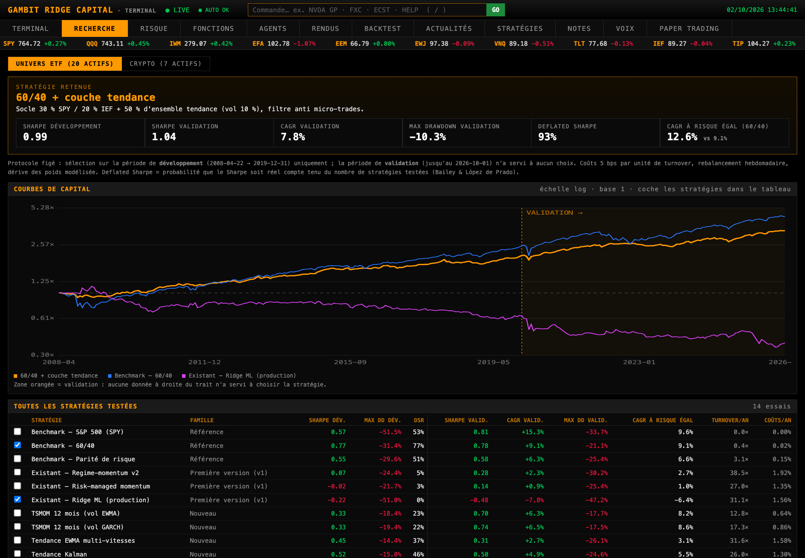
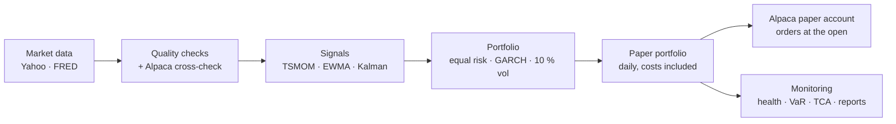
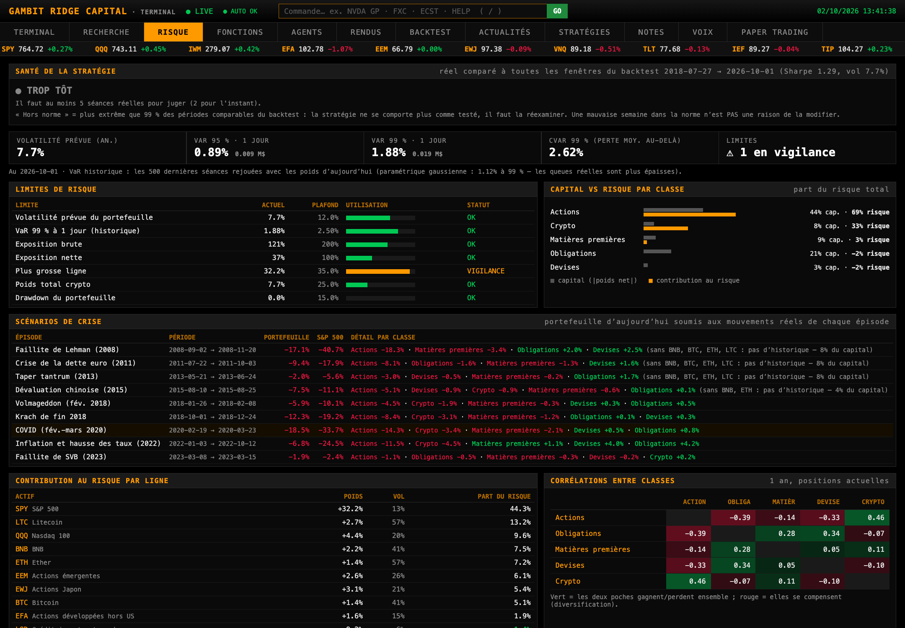

# Gambit Ridge Capital

[](https://github.com/TM357B/gambit-ridge-capital/actions/workflows/tests.yml)

**A systematic multi-asset fund, built end to end as a personal research project — with an evaluation protocol designed not to fool itself.**



> Research and paper-trading project. No outside capital is managed, nothing here is investment advice, and every performance figure below is a backtest or paper trading, labelled as such.

## Headline result (backtest, costs included)

A 60/40 core plus a trend-following overlay on 20 tradable ETFs, **selected on 2008–2019 only**, then measured on 2020–2026 — a period never used to choose anything:

| Strategy | Sharpe, development 2008–2019 | Sharpe, validation 2020–2026 | Max drawdown, validation | Deflated Sharpe (dev) |
|---|---|---|---|---|
| **60/40 + trend overlay (retained)** | **0.99** | **1.04** | **−10.3 %** | **93 %** |
| 60/40 (benchmark) | 0.77 | 0.78 | −21.1 % | 77 % |
| Ridge ML ranking (first version, retired) | −0.22 | −0.48 | −47.2 % | 0 % |

The trend layer is nearly uncorrelated with the 60/40 core (≈0.05) and halves the drawdown. Fourteen ETF strategies and four crypto strategies were compared; the full table lives in `data/research_report.json` and in the terminal's *Recherche* tab.

## What failed — and why it matters

- **The ML model.** A cross-sectional ridge regression credited with a +0.63 Sharpe turned out to lose money (−0.48) once tested on a genuinely tradable universe: the original figure came from eight FRED series, some of them untradable spot prices.
- **FX carry (G10).** A textbook risk premium, yet a Sharpe of ≈0.03 over 2006–2019; adding it lowers the retained strategy's development Sharpe from 0.99 to 0.75–0.80. Rejected — even though one variant looked good on the validation period, because choosing there would be cheating.
- **HMM regime filter.** Slightly lower drawdown, no Sharpe gain: not worth an extra layer.

## Method

- **Tradable universe only** — 20 ETFs across equities, bonds, commodities and currencies (2007+), 7 cryptocurrencies (2017+).
- **Two periods, fixed in advance** — development for selection, validation reported as is. Parameters taken from the literature, no grid search.
- **Realistic simulation** — 5 bps per unit of turnover on ETFs (20 bps crypto), weekly rebalancing, weight drift between rebalances.
- **No look-ahead, tested** — every signal is a recursive filter; an automated test recomputes it on truncated history and checks it is identical.
- **Multiple-testing correction** — Deflated Sharpe Ratio (Bailey & López de Prado, 2014).
- **Models** (Dixon, Halperin & Bilokon, *Machine Learning in Finance*, 2020): 12-month time-series momentum, multi-speed exponential smoothing, Kalman local-linear-trend filter, GARCH(1,1) volatility forecasts, hidden Markov regimes, ridge regression.
- **Portfolio construction** — equal risk per position (GARCH volatility), 10 % ex-ante volatility target with a shrunk EWMA covariance; fund allocation 90 % ETF / 10 % crypto, set by risk budget.

## Operations



The fund runs on its own: decision after the New York close, orders replicated on an Alpaca paper account at the next open, daily data-quality checks with an independent second price source, transaction-cost analysis on real fills, a strategy-health monitor comparing live results with every comparable backtest window, monthly reports and phone alerts.

A Bloomberg-style local terminal (macOS app + iPhone web app) shows the portfolio, risk (VaR, stress tests on nine historical crises, risk contributions), attribution, research results and market functions (`GP`, `DES`, `FXC`, `WCRS`, `ECST`, `WEI`, `GC`).



## How this was built

I designed and directed this project; most of the code was written with AI coding assistants (Mistral Code for the first version, then Claude Code). My role was the one a portfolio manager or research lead plays:

- **Defining the method** — tradable universe only, frozen protocol, development vs validation, costs, multiple-testing correction.
- **Challenging the results** — asking why the ML model "worked", which led to discovering it did not; rejecting carry even when one variant looked good on the validation period.
- **Making the decisions** — which strategy goes live, the 90/10 allocation by risk budget, when not to touch the strategy.

Using AI made it possible to build the whole chain alone; the judgement calls, and the mistakes caught along the way, are mine.

## What I learned

- **Most backtests lie by construction.** The first version's best model looked strong only because the universe was partly untradable and the evaluation reused the same data to choose and to judge.
- **Diversification beats prediction.** Trend following is a mediocre strategy on its own (Sharpe ≈0.5–0.7) but a strong complement to a 60/40, because it is nearly uncorrelated with it.
- **Costs and plumbing matter as much as signals.** Weight drift, transaction costs, data quality, time zones and broker constraints (shorts that cannot be borrowed) all moved the results.
- **Discipline is a feature.** The hardest rule is not modifying a live strategy after a bad week.

## Quick start

```bash
python3 -m venv .venv && .venv/bin/pip install numpy pytest pyyaml
GRC_OFFLINE=1 .venv/bin/python -m unittest discover -s tests   # offline test suite
.venv/bin/python -m gambit_ridge.research.evaluate --skip-ml   # full evaluation bench (downloads prices)
.venv/bin/python -m gambit_ridge.app.server                    # terminal on http://127.0.0.1:8765
```

numpy is the only required dependency: every model (GARCH, Kalman, HMM, ridge…) is implemented from scratch.

## Repository map

| Path | Content |
|---|---|
| `gambit_ridge/research/` | signals, portfolio construction, backtester, evaluation bench, production portfolio, data-quality checks |
| `gambit_ridge/monitoring/` | strategy health, transaction-cost analysis |
| `gambit_ridge/brokers/` | Alpaca paper-account replication (Saxo simulation client, unused) |
| `gambit_ridge/app/` | local terminal (server + web UI) |
| `gambit_ridge/ops/` | daily automated run |
| `tests/` | 86 tests, run in CI |

## Notes

Code comments and the terminal UI are in French. Market data is downloaded at run time and is not redistributed in this repository.

## Disclaimer

Gambit Ridge Capital is a personal research project, not a regulated investment firm or a fund open to investors. Results come from backtests and paper trading and do not predict future performance.
